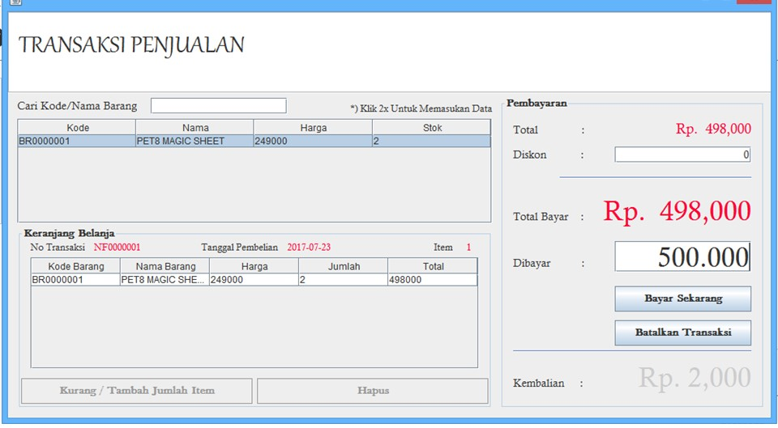

# Petshop Application

- - - -

## Function

1. To assist and facilitate data entry and storage of goods and the process of sales and purchase transactions at PetShop.
2. So that data storage related to the transaction process will be safer and neatly arranged.
3. Trial calculation and payment applications in sales transactions at PetShop.

- - - -

## Team

### Students
- Hani Alfiyyah Nurulhuda
- Sinta Septining
- Siska Rizki Amalia

### Lecture
- Angga Setiyadi, S.Kom., M.Kom.

### Credit
- Indonesia Computer University
